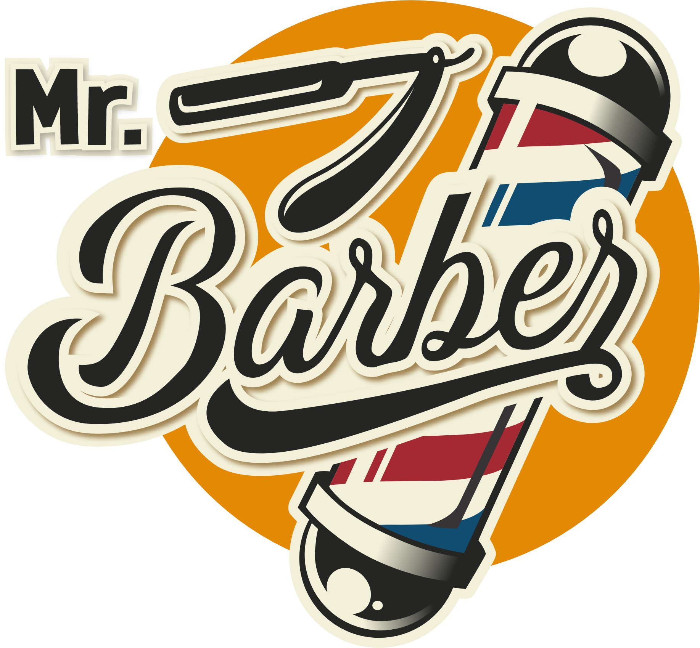
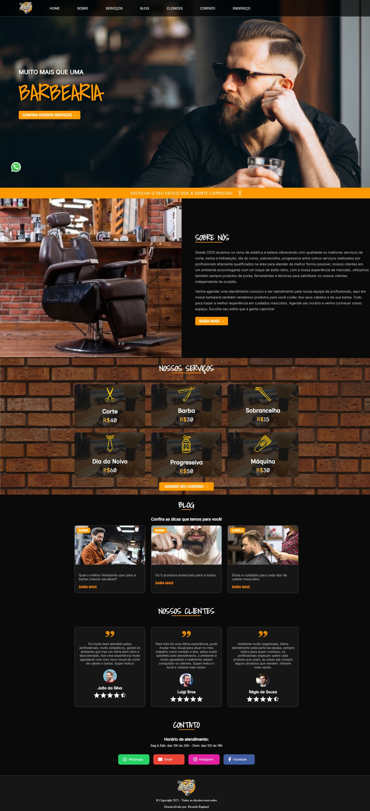
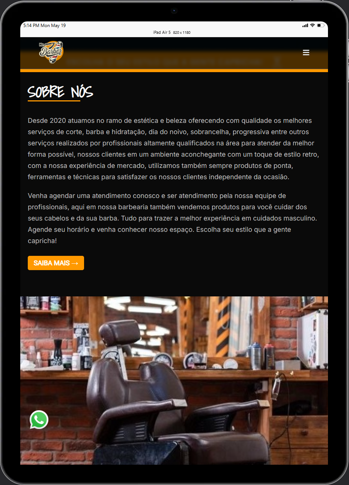
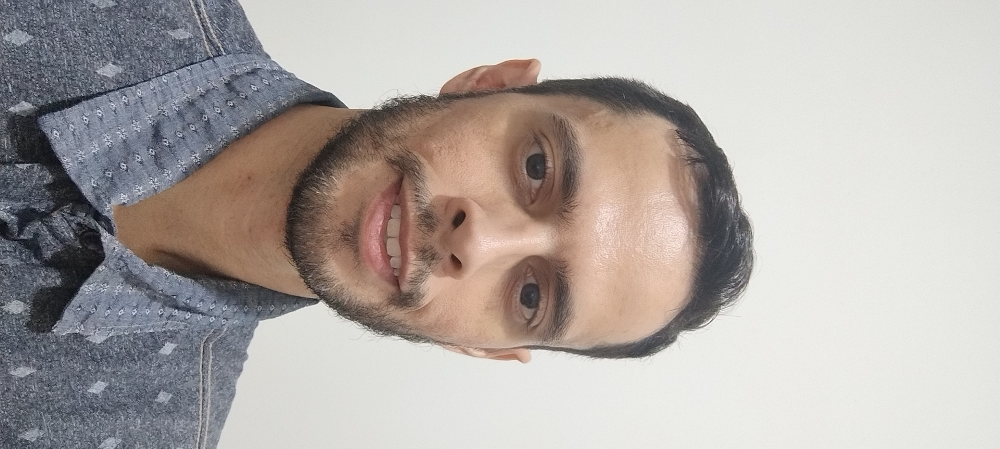

  

<h1 align="center"> 
	💈​ Barbearia Mr. Barber 💈​
</h1>

	

## 💻 Sobre o projeto

  Projeto de um site para um salão de barbearia e Cabeleireiro, o site está dividido entre seções para tornar a navegação mais organizada para o usuário, 
  o projeto foi desenvolvido de forma bem estruturada com HTML semântico e responsivo com media query para o usuário poder navegar em todos os dispositivos móveis, 
  podendo também acessar o menu de navegação com Javascript. O site apresenta o sobre da empresa, os serviços prestados, blogs, depoimentos de clientes, links de 
  contatos e o mapa com o endereço do local.

---

## 🎨 Imagens do Projeto

### Web

  

### Mobile

  	
  	

	

---

## 🛠 Tecnologias

<h3>As seguintes tecnologias foram utilizadas no projeto:</h3>

  
  
  
  
  
  

---

## 👨‍💻​ Autor

 
<b>Ricardo Raphael</b>✨

---

Feito com ❤️ por Ricardo Raphael 👋🏽 [Entre em contato!](https://www.linkedin.com/in/ricardoapraphael/)

